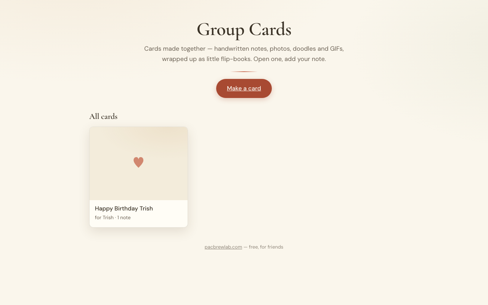

# Group Cards

A self-hosted group greeting card app built on Cloudflare Pages + D1. Everyone signs the same card — handwritten notes, photos, doodles, and GIFs — and the recipient gets a little flip-book to open.



## Features

- **Flip-book viewer** — animated page-turn on desktop, swipe on mobile
- **Four contribution types** — handwritten text notes, photos, GIFs (Giphy/Tenor), and finger-drawn doodles
- **Flexible layout** — quarter, half, or full-page sizes for media items
- **Organizer tools** — edit title/recipient, remove entries, toggle privacy, delete card
- **No accounts** — admin and share links are token-protected; edit tokens let contributors fix their own items
- **Print / PDF** — Download PDF or print a foldable booklet
- **Optional GIF search** — powered by Giphy when `GIPHY_API_KEY` is configured; falls back gracefully to paste-a-link input

## Prerequisites

- Node 18+
- A Cloudflare account
- `npx wrangler login`

## Deploy

### 1. Create the D1 database

```bash
npx wrangler d1 create group-cards-db
```

Copy the returned `database_id` and paste it into `wrangler.toml`:

```toml
database_id = "paste-your-id-here"
```

### 2. Apply the schema

```bash
npx wrangler d1 execute group-cards-db --remote --file=schema.sql
```

### 3. Create the Pages project

```bash
npx wrangler pages project create group-cards
```

### 4. Deploy

```bash
npx wrangler pages deploy
```

### 5. Secrets (optional)

| Name | Required? | What it does | Where to get it |
|------|-----------|--------------|-----------------|
| `GIPHY_API_KEY` | No | Enables in-app GIF search. Without it the GIF tab shows a paste-a-link fallback. | [developers.giphy.com](https://developers.giphy.com/) — free tier works fine |

```bash
npx wrangler pages secret put GIPHY_API_KEY
```

## Local development

```bash
# Seed the local D1 database
npx wrangler d1 execute group-cards-db --local --file=schema.sql

# Put any secrets in .dev.vars (gitignored — see .dev.vars.example)
cp .dev.vars.example .dev.vars
# edit .dev.vars and fill in values

# Start the dev server
npx wrangler pages dev
```

## Notes

- `GIPHY_API_KEY` is optional. When absent the server returns `501 {error:"no_key"}` and the GIF pane shows a paste-a-link input — no errors, no broken UI.
- Cards can be public (listed in the gallery) or private (link-only). Privacy can be toggled after creation via the organizer tools.
- The admin link is the only credential for managing a card — save it somewhere.

## License

MIT — see [LICENSE](LICENSE).
